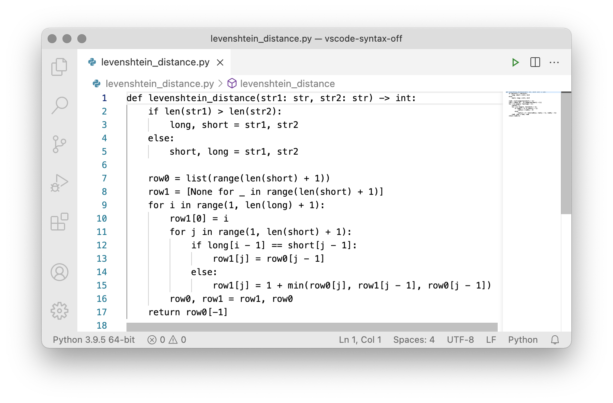
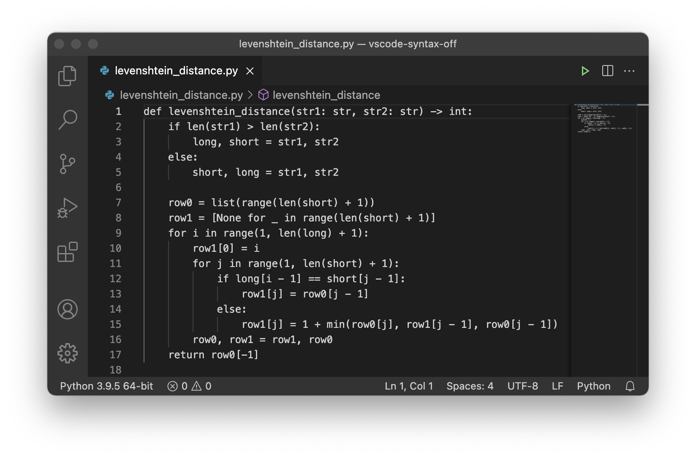

# Syntax Off

Syntax Off is a Visual Studio Code theme that removes syntax highlighting. Two
variants are provided, _Syntax Off Light_ and _Syntax Off Dark_. These are based
respectively on the _Light+_ and _Dark+_ themes distributed with Visual Studio
Code.

In addition to removing syntax highlighting, Syntax Off themes the activity bar
and status bar to match the surrounding editor components (in _Light+_ and
_Dark+_ the status bar is bright blue, and in _Light+_ the activity bar is dark
in an otherwise light theme).

|         Syntax Off Light         |         Syntax Off Dark         |
| :------------------------------: | :-----------------------------: |
|  |  |

## Installation

Syntax Off is available in the [Visual Studio Marketplace][marketplace]. To
install it, click [here][installer].

## Copyright

Copyright © 2021 [Scott Stevenson].

Syntax Off is distributed under the terms of the [ISC licence].

[installer]: vscode:extension/srstevenson.syntax-off
[isc licence]: https://opensource.org/licenses/ISC
[marketplace]:
  https://marketplace.visualstudio.com/items?itemName=srstevenson.syntax-off
[scott stevenson]: https://scott.stevenson.io
